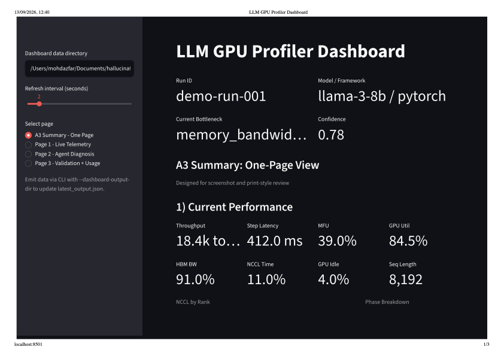
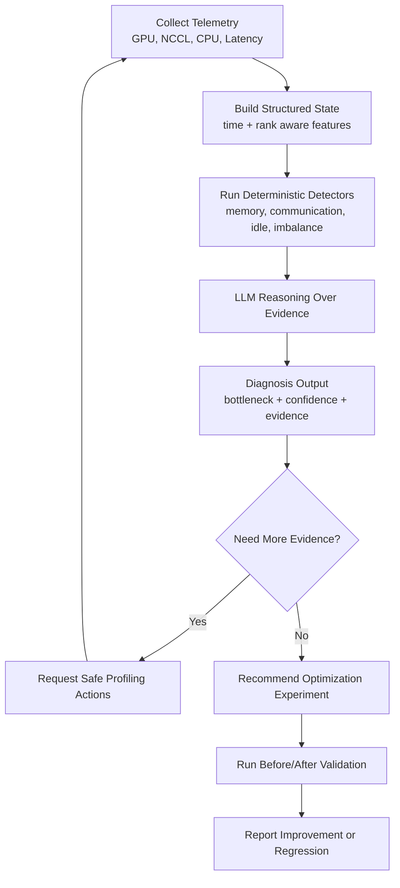

# LLM GPU Profiler

LLM GPU Profiler is an evidence-grounded performance engineering agent for training and inference workloads. It combines time/rank-aware telemetry, deterministic bottleneck detectors, and structured LLM reasoning to diagnose root causes, request targeted follow-up profiling, and validate whether recommended changes improve throughput, latency, and efficiency.

## Dashboard Preview

Preview generated from the latest dashboard PDF:

[](./LLM%20GPU%20Profiler%20Dashboard.pdf)

## Simple Flow Diagram



This is the full loop: measure -> reason -> test -> validate.

## Core Architecture

```text
GPU/Workload Telemetry
  -> Structured Performance State
  -> LLM Diagnostic Agent
  -> Diagnosis + Explanation + Recommendation
  -> Optional Validation Run
```

## What We Want To Do

1. Collect real runtime signals continuously.
2. Normalize raw telemetry into structured state (not raw logs).
3. Use an LLM-style reasoning layer for diagnosis.
4. Enforce structured output with confidence and evidence.
5. Let the agent request additional profiling when evidence is weak.
6. Recommend experiments, not assertions.
7. Validate changes using before/after metrics.

## Telemetry Inputs

- GPU util, SM/Tensor Core activity, MFU
- HBM bandwidth and memory usage
- NCCL communication time
- CPU/data-loader overhead
- GPU idle fraction
- Step latency and tokens/sec
- Batch size, sequence length, world size
- Kernel timing overhead

Telemetry supports both:
- aggregate snapshot metrics (`metrics.json`)
- time/rank-aware events (`telemetry_events.json`)

Additional provider-specific file inputs:
- `dcgm`: `dcgm_metrics.json`, `dcgm_events.json`
- `pytorch_profiler`: `pytorch_metrics.json`, `pytorch_events.json`

## Structured State (Example)

```text
gpu_util_pct: 42
mfu_pct: 27
hbm_bw_pct: 88
nccl_time_pct: 7
gpu_idle_pct: 4
throughput_toks_per_sec: 1850
sequence_length: 8192
```

## Agent Output Contract

The diagnostic layer must return:
- primary bottleneck
- confidence
- evidence (with exact supporting telemetry signals)
- likely root causes
- missing evidence
- recommended actions
- next experiment
- optional profiling request

## Agentic Loop

```text
Observe -> Reason -> Hypothesize -> Experiment -> Measure -> Learn
```

When evidence is insufficient, the agent explicitly requests additional profiling, for example collective-level NCCL breakdown for a fixed step window.

## Current Status

- Pluggable telemetry providers: `file`, `nvml`, `dcgm`, `pytorch_profiler`
- Time/rank-aware state builder with metric distributions and phase breakdown
- Deterministic detector layer feeding baseline and LLM reasoning
- Live LLM provider abstraction with retries and fallback
- Policy-gated typed profiling actions
- Synthetic benchmark harness for baseline diagnosis quality

The most important design rule remains: the LLM reasons over measured facts; it does not generate the facts.

## Repository Layout

```text
src/gpu_profiler/
  main.py
  config.py
  models.py
  pipeline.py
  telemetry/base.py
  telemetry/collector.py
  telemetry/nvml.py
  telemetry/dcgm.py
  telemetry/pytorch.py
  state/builder.py
  state/features.py
  state/topology.py
  detectors/engine.py
  detectors/memory.py
  detectors/communication.py
  detectors/underfed.py
  detectors/imbalance.py
  detectors/cpu.py
  diagnosis/baseline.py        # deterministic baseline classifier
  diagnosis/llm_agent.py       # LLM reasoning contract
  llm/base.py
  llm/factory.py
  llm/openai_compatible.py
  llm/mock.py
  actions/models.py
  actions/policy.py
  actions/executor.py
  validation/evaluator.py
  evaluation/benchmarks.py
  evaluation/reporting.py
```

## Quick Start

Install dependencies:

```bash
python -m pip install -e .
```

```bash
python -m gpu_profiler.main \
  --input ./sample_data/before \
  --telemetry-provider file \
  --followup-input ./sample_data/followup \
  --validate-input ./sample_data/after \
  --dashboard-output-dir ./dashboard_data \
  --mode train \
  --max-rounds 2
```

Run synthetic benchmark scenarios:

```bash
python -m gpu_profiler.main --input . --run-benchmarks
```

Write benchmark reports (CSV + Markdown):

```bash
python -m gpu_profiler.main \
  --input . \
  --run-benchmarks \
  --benchmark-report-dir ./benchmark_reports
```

## Live Dashboard (Streamlit)

Run pipeline with dashboard snapshot output:

```bash
python -m gpu_profiler.main \
  --input ./sample_data/before \
  --telemetry-provider file \
  --dashboard-output-dir ./dashboard_data
```

Then launch dashboard:

```bash
streamlit run dashboard/streamlit_app.py
```

or

```bash
./scripts/run_dashboard.sh
```

The dashboard shows three layers:
- live telemetry panel (utilization, MFU, HBM, NCCL, latency, throughput)
- agent diagnosis panel (bottleneck, confidence, evidence, missing evidence, actions)
- validation panel (before/after deltas and improvement status)

If the agent requests more profiling, place action outputs at:

```text
<followup-input>/actions/<action_id>.json
```

## Prompt + Schema Workflow

1. Generate a strict prompt for the current measured state:

```bash
python -m gpu_profiler.main --input ./sample_data/before --mode train --print-prompt
```

2. Call your LLM externally and save its **raw JSON-only** output, for example:
`./sample_data/llm_response.json`

3. Validate and run the pipeline with that response:

```bash
python -m gpu_profiler.main \
  --input ./sample_data/before \
  --llm-response-file ./sample_data/llm_response.json \
  --followup-input ./sample_data/followup \
  --validate-input ./sample_data/after
```

The response is validated against the `DiagnosticOutput` schema. Invalid output fails fast.

The pipeline always computes a deterministic baseline diagnosis and, when LLM JSON is provided, also computes LLM diagnosis. Output includes both so you can compare baseline vs LLM on the same telemetry state.

## Live LLM Providers

Supported provider modes:
- `disabled` (default): baseline-only
- `mock`: local mock client
- `openai`: hosted OpenAI-compatible endpoint
- `local_openai`: local OpenAI-compatible server (for example local vLLM API)

Example (live provider):

```bash
python -m gpu_profiler.main \
  --input ./sample_data/before \
  --llm-provider openai \
  --llm-model gpt-4o-mini \
  --llm-api-base https://api.openai.com \
  --llm-api-key-env OPENAI_API_KEY \
  --llm-timeout-s 20 \
  --llm-max-retries 2
```

If provider call fails or response schema is invalid, pipeline falls back to deterministic baseline diagnosis and records failure metadata in `llm_calls`.

## Safety Model

- LLM proposes typed action requests only.
- Executor runs only allowlisted profiling actions with bounded parameters.
- Arbitrary shell execution is not part of the action path.

